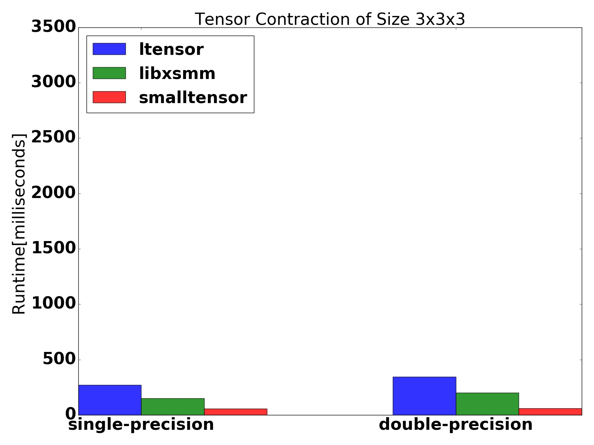
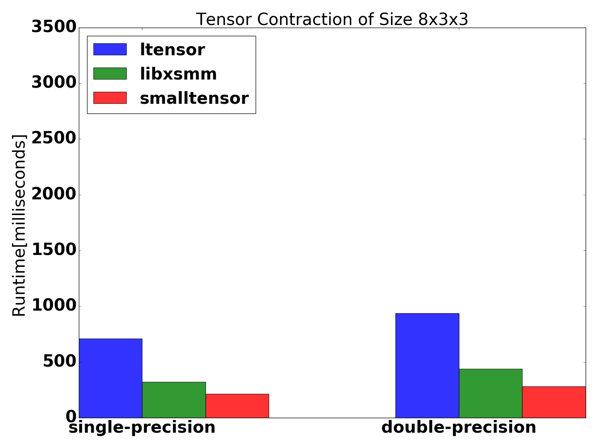
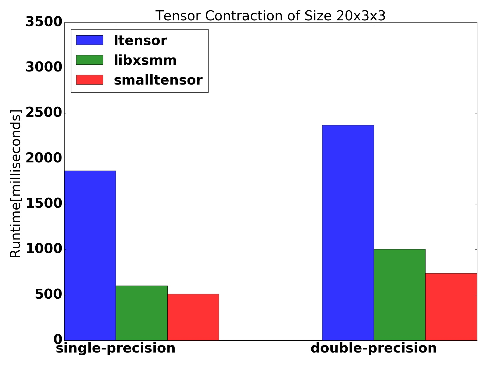
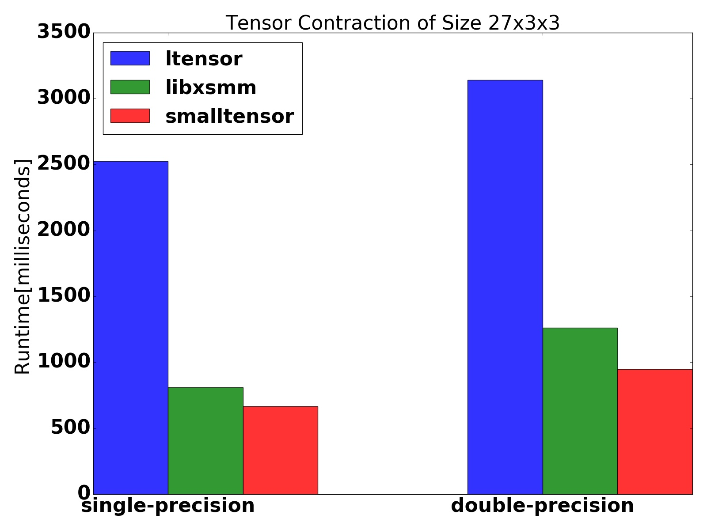

## Small Tensor Library

This is a small tensor library which supports full Einstein notations. 

The implementation is based on explicit SIMD intrinsics function for the bare-metal performance.

#### Small Tensor without heap memory in Runtime. 
Simple usage example for 3 by 3 matrix:
```cpp
tensor2<double,3,3> stress;
```
This is useful is either of the following cases:

* Avoid the malloc in the runtime.
* Since the data is kept in-place, you can save extra cache miss in the common case.


#### Why this library might be useful to you

To do fast tensor operations, one needs to write them in C/Fortran code style for performance. This means that one needs to use several "for loops" in order to do the products and sums component-wise. 

Although computationally efficient, this type of programming style is error prone and makes codes lenghtier and hard to be debugged.

With small tensor library, we get the performance of a C code style combined with the code clarity and simplicity given by indicial tensor notation.

To perform tensor operations with small-tensor, one just needs to write in the .cpp the following "exactly replicate" code:

```cpp
using namespace smalltensor ;
eindex<'i'> i; eindex<'j'> j; eindex<'k'> k; eindex<'l'> l;
```

A double contraction of a 4th-order tensor stiffness with a 2nd-order tensor strain can be written simply as:
```cpp
stress(i,j)=stiffness(i,j,k,l)*strain(k,l);
```


#### API Examples
##### Declaration.

```cpp
using namespace smalltensor ;
tensor1<double,10> vec;
tensor2<double,3,3> stress;
tensor3<double,2,3,3> cosserat; 
tensor4<double,3,3,3,3> stiffness;
```

##### Einstein Notations.

```cpp
A(i,j) = B(i,k) * C(k,j) ;
```

All APIs for Einstein notations are [available here](list_of_operations.md)

##### Performance

<!--  -->



